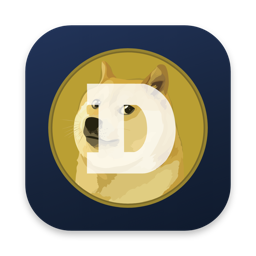

<p align="center">
  
</p>

<h1 align="center">DogecoinVM Wallet</h1>

<p align="center">
  A native macOS wallet for <strong>Dogecoin</strong> and <strong>DogecoinVM</strong>, and the bridge between them.
  <br/>One key, one address on both networks, and Touch ID for every payment.
</p>

---

## What it does

- **Both networks, one key.** On mainnet, Dogecoin and DogecoinVM share address formats, so your key has
  the same address on both. The wallet shows both balances side by side.
- **Send** on either network, chosen explicitly each time.
- **Move to DogecoinVM** in one step: the wallet pays your personal deposit address from your Dogecoin
  balance. It derives that address itself from the peg signers' keys and refuses to pay one that doesn't
  match what the bridge says.
- **Withdraw to Dogecoin**, to your own address by default.
- **Touch ID for every payment.** The key never leaves your Mac.

## How your key is kept

Dogecoin keys are secp256k1, which the Mac's Secure Enclave can't hold directly. So the key is stored in a
file in Application Support, **encrypted to a Secure Enclave key** that only Touch ID (or your Mac's password,
on a Mac without Touch ID) can use. The file is useless on any other Mac. Back up your key from Settings,
ideally into a password manager.

The wallet talks to a DogecoinVM bridge (default: <https://metaldoge.com>) for balances and to broadcast
transactions. The bridge never sees your key, and the wallet checks what it's told: every coin it spends is
verified against the raw transaction that created it, so a dishonest server can't inflate a fee.

## Architecture

| Layer | Tech | Role |
| --- | --- | --- |
| `core/` | Rust (`dogevm-wallet-core`) | Keys, addresses, deposit addresses, and building and signing transactions. Exposed to Swift through one JSON call over a C ABI. |
| `apps/macos/` | Swift, SwiftUI (macOS 14+) | The app, and the Secure Enclave vault. Built with [XcodeGen](https://github.com/yonaskolb/XcodeGen). |

The core must agree **byte for byte** with the DogecoinVM web wallet. Its tests run against vectors the web
wallet generates and the DogecoinVM Go code verifies with btcd's script engine
(`core/tests/vectors/wallet-vectors.json`, from
[dogecoin-vm](https://github.com/paulgnz/dogecoin-vm) `cmd/dogevm/testdata`). `scripts/sync-vectors.sh` copies
a new version and runs the tests.

## Building

```sh
make hooks                                   # secret scanning on commit and push
scripts/build-core-macos.sh                  # the Rust core, universal
cd apps/macos
cp Signing.xcconfig.example Signing.xcconfig # set your team ID
xcodegen generate && open DogecoinVMWallet.xcodeproj
```

Release: `apps/macos/scripts/release-dmg.sh` archives, signs with Developer ID, notarizes and staples a DMG
for download outside the App Store (`--no-notarize` to skip notarization).

## Status

Beta, on mainnet with real DOGE and the bridge's beta caps. Keep amounts small. Not audited.
